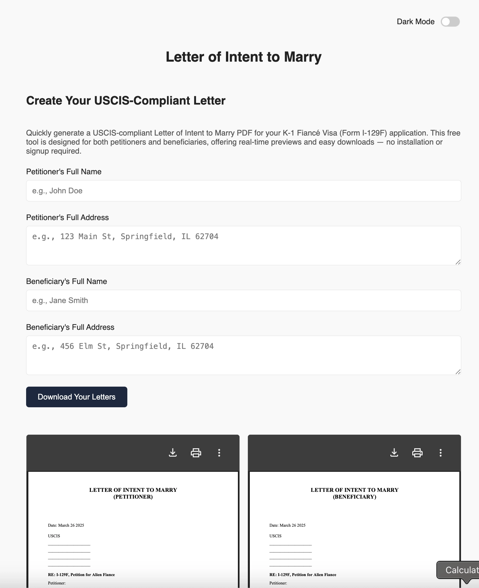
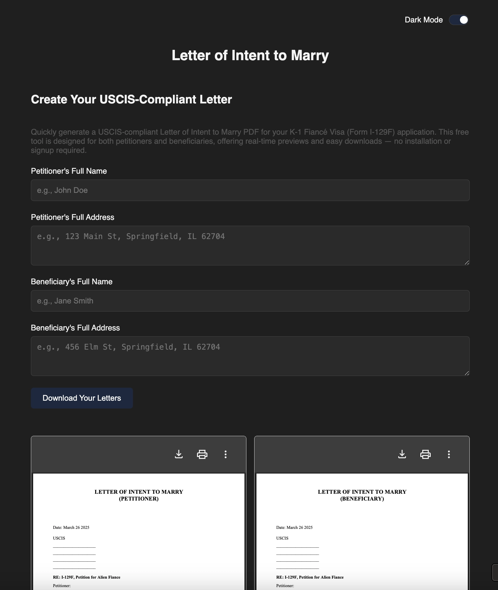

# 💍 Intent to Marry PDF Generator

Create USCIS-compliant **Letters of Intent to Marry** for your **K-1 Fiancé Visa (Form I-129F)** application — 100% free, no login, and no data stored.

🔗 **Live Demo:** [intentpdf.github.io](https://intentpdf.github.io)

---

## ✨ Features

- ✅ Generate both **Petitioner** and **Beneficiary** letters
- 🖨️ Real-time **PDF preview**
- 🌙 Built-in **Dark Mode**
- 📄 Fully formatted to match **K-1 Fiancé Visa** guidelines
- ⚡ Works **entirely in the browser** — no server, no storage
- 📥 Instant download — ready to submit with your I-129F package

---

## 📸 Screenshots

> Replace with your actual screenshots in `images/`.

---

## 🚀 How to Use

1. Open the [Live Tool](https://intentpdf.github.io)
2. Fill in the Petitioner and Beneficiary information
3. View real-time previews
4. Click **Download PDFs**

---

## 🛠️ Tech Stack

- HTML + CSS + JavaScript
- [jsPDF](https://github.com/parallax/jsPDF) for PDF rendering
- GitHub Pages for hosting
